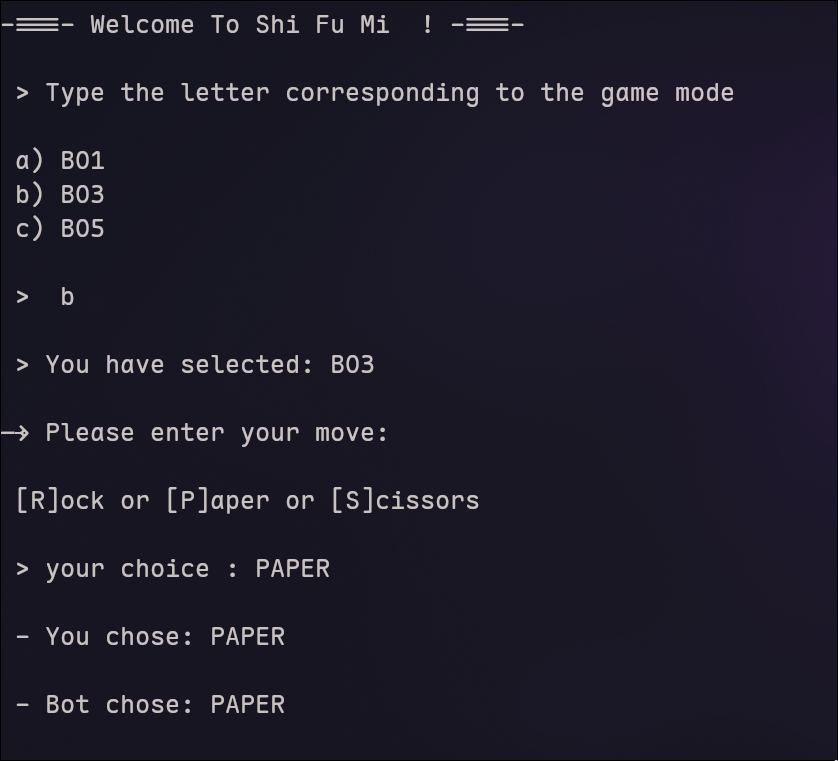
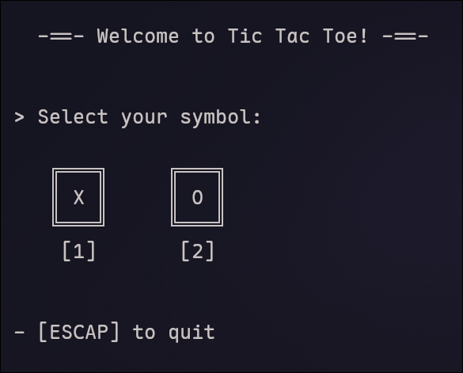
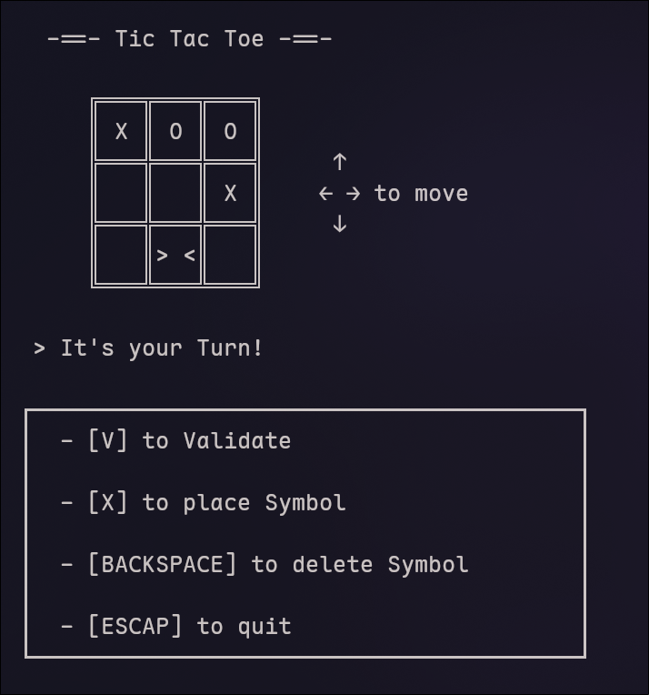

# Terminal Games Collection

A collection of classic terminal-based games written in Java - perfect for quick breaks or nostalgic gaming sessions.

## 🎮 Games Included

### 1. ShiFuMi (Rock-Paper-Scissors)
Challenge the bot in this classic hand game. Best of luck!

**Features:**
- Play against an AI opponent
- Clear input validation
- Score tracking



### 2. Tic-Tac-Toe
The timeless grid battle against a bot opponent.

**Features:**
- Play vs AI
- Clean terminal UI
- Win detection & draw handling




## 🚀 Quick Start

### Prerequisites
- Java 21 or higher
- Terminal with ANSI support (for better visuals)

### Check your Java version:
```bash
java -version
```

## Running the Games

```bash
cd <Game Directory>
```

### Run with
```bash
make run
```
